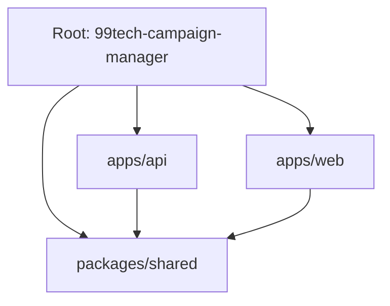

# Architecture Overview: 99tech-campaign-manager

This project is a high-performance **Campaign Management System** built with a monorepo architecture. 

## 🗺️ Monorepo Structure

| Component | Tech Stack | Responsibility |
| :-- | :-- | :-- |
| **`apps/api`** | Express, Sequelize, Node.js | Business logic, Data persistence, Authentication, Sanitization. |
| **`apps/web`** | Next.js, Zustand, Tailwind | User Interface, Frontend routing, Client-side auth, Rendering. |
| **`packages/shared`** | Zod, TypeScript | Universal schemas, Type definitions, Shared enums (CampaignStatus). |

---

## 🏗️ Technical Implementation Patterns

### 1. Data Flow (3-Layer Pattern)
All API endpoints follow this strict path:
1. **Controller**: Validates input using Zod schemas from `@99tech/shared`.
2. **Service**: Processes business rules (e.g., checking ownership, sanitizing HTML contents).
3. **Repository**: Executes SQL via Sequelize models.

### 2. High-Performance Pagination
To handle millions of campaign recipients, we avoid `OFFSET` pagination. Instead, we use **Keyset (Cursor-based) Pagination**.
- **Performance**: Constant O(1) lookups regardless of page depth.
- **Reliability**: No duplicate or skipped results when records are inserted or deleted during scrolling.

### 3. Security Hardening
- **XSS Protection**: Dual-layered sanitization using `sanitize-html` (API) and `DOMPurify` (Web).
- **Link Integrity**: Automatic transformation of all campaign links to `target="_blank"` with `rel="noopener noreferrer"`.
- **Infrastructure**: Fully containerized with Docker, featuring optimized multi-stage builds for both Web and API.

---

## 🛠️ Key Developer Workflows

- **Local Dev**: `yarn dev` runs the entire stack concurrently.
- **Database**: PostgreSQL 15, managed via Docker.
- **Seeding**: `yarn db:seed` inserts core test data (User, Campaigns, Recipients).
- **Testing**: `yarn test` runs Jest suites in all workspaces.
